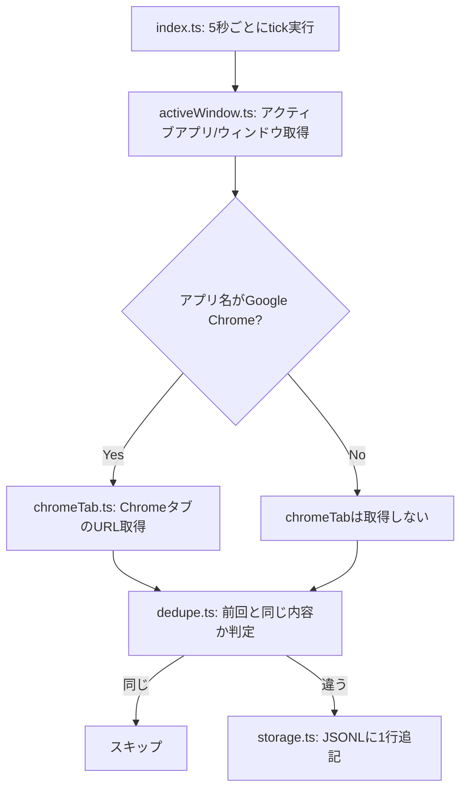

# macOS Activity Capture Spike

[Issue #1](https://github.com/cs-noguchi/personal-activity-memory/issues/1) の技術検証用スクリプト。
macOS上でアクティブアプリ名・ウィンドウタイトル・ChromeのタブURLが取得できるかを確認する。

## 処理の流れ



各ファイルの役割:

| ファイル | 役割 | 呼ばれるタイミング |
| --- | --- | --- |
| `src/index.ts` | 全体のループを回すエントリーポイント | `npm run capture` 実行時、常時 |
| `src/activeWindow.ts` | アクティブアプリ名・ウィンドウタイトルを取得 | tickのたびに毎回 |
| `src/chromeTab.ts` | ChromeのタブURL・タイトルを取得 | アクティブアプリがChromeの時だけ |
| `src/dedupe.ts` | 前回記録した内容と同じか判定 | 取得後、保存する前に毎回 |
| `src/storage.ts` | JSONLファイルへの追記 | 前回と内容が違うときだけ |
| `src/types.ts` | データの型定義のみ（処理は無い） | - |

## セットアップ

```bash
cd spikes/macos-activity-capture
npm install
```

## 実行

```bash
npm run capture
```

数秒間隔でアクティブウィンドウ情報をポーリングし、`data/activity-log.jsonl`（gitignore対象）に追記する。
直前の記録と内容（アプリ名・ウィンドウタイトル・ChromeタブURL/タイトル）が同じ場合は記録をスキップし、
変化があったときだけ1行追記する。
`Ctrl+C`で停止すると取得件数を表示する。

## テスト

```bash
npm test
```

AppleScript出力のパースやJSONLシリアライズなど、OS呼び出しを含まない純粋関数のみをテストしている。

## 既知の制約・必要な権限

- アクティブウィンドウ情報の取得（`active-win`）には **アクセシビリティ** 権限が必要。
  未許可の場合、`システム設定 → プライバシーとセキュリティ → アクセシビリティ` で実行中のターミナルアプリを許可する。
- ChromeのタブURL取得はAppleScript経由のため、初回実行時に **自動化(Automation)** の許可ダイアログが表示される想定。
- 上記いずれも失敗時はプロセスをクラッシュさせず、エラーをログに出力してポーリングを継続する。
