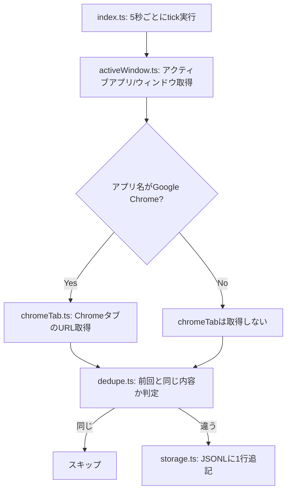

# macOS Activity Capture Spike

[Issue #1](https://github.com/cs-noguchi/personal-activity-memory/issues/1) の技術検証用スクリプト。
macOS上でアクティブアプリ名・ウィンドウタイトル・ChromeのタブURLが取得できるかを確認する。

## 処理の流れ



各ファイルの役割:

| ファイル | 役割 | 呼ばれるタイミング |
| --- | --- | --- |
| `src/index.ts` | 全体のループを回すエントリーポイント | `npm run capture` 実行時、常時 |
| `src/activeWindow.ts` | アクティブアプリ名・ウィンドウタイトルを取得 | tickのたびに毎回 |
| `src/chromeTab.ts` | ChromeのタブURL・タイトルを取得 | アクティブアプリがChromeの時だけ |
| `src/dedupe.ts` | 前回記録した内容と同じか判定 | 取得後、保存する前に毎回 |
| `src/storage.ts` | JSONLファイルへの追記 | 前回と内容が違うときだけ |
| `src/types.ts` | データの型定義のみ（処理は無い） | - |

## セットアップ

```bash
cd spikes/macos-activity-capture
npm install
```

## 実行

```bash
npm run capture
```

数秒間隔でアクティブウィンドウ情報をポーリングし、`data/activity-log.jsonl`（gitignore対象）に追記する。
直前の記録と内容（アプリ名・ウィンドウタイトル・ChromeタブURL/タイトル）が同じ場合は記録をスキップし、
変化があったときだけ1行追記する。
`Ctrl+C`で停止すると取得件数を表示する。

## テスト

```bash
npm test
```

AppleScript出力のパースやJSONLシリアライズなど、OS呼び出しを含まない純粋関数のみをテストしている。

## 既知の制約・必要な権限

- アクティブウィンドウ情報の取得（`active-win`）には **アクセシビリティ** 権限が必要。
  未許可の場合、`システム設定 → プライバシーとセキュリティ → アクセシビリティ` で実行中のターミナルアプリを許可する。
- ChromeのタブURL取得はAppleScript経由のため、初回実行時に **自動化(Automation)** の許可ダイアログが表示される想定。
- 上記いずれも失敗時はプロセスをクラッシュさせず、エラーをログに出力してポーリングを継続する。

### 既知の限界: `windowTitle` が空になることがある（権限とは無関係）

2026-08-16に約2.5時間の実データ収集を行ったところ、104件中34件(約33%)で`windowTitle`が空文字だった。
アクセシビリティ・画面収録どちらの権限も許可済みの状態でも発生し、アプリごとに発生率が大きく異なった
（Google Chrome 88%、ChatGPT Atlas 56%、ChatGPT 35%に対し、Cursor 0%、Claude 12%）。

原因は権限不足ではなく、[active-win(get-windows)側の既知の挙動](https://github.com/sindresorhus/get-windows/issues/169)。
ドロップダウンメニューや通知など、アプリが内部的に生成する**タイトルを持たない一時的なサブウィンドウ**が
「最前面のウィンドウ」として扱われてしまうことがあり、この場合`kCGWindowName`（ウィンドウタイトル）が
OSレベルで本当に空になる。動的なUIの多いアプリ（ブラウザ、Webラッパー系アプリ）ほど発生しやすい。

Chromeについては`chromeTab.title`で代替できているため実害は無い。ChatGPT等の同種アプリについては、
MVPの段階ではこの限界を受け入れ、「タイトルは取れないことがある」前提でデータを扱う。
（`getOpenWindows()`で複数ウィンドウを見て回避する方法もIssue内で報告されているが、本スパイクでは未実施）
